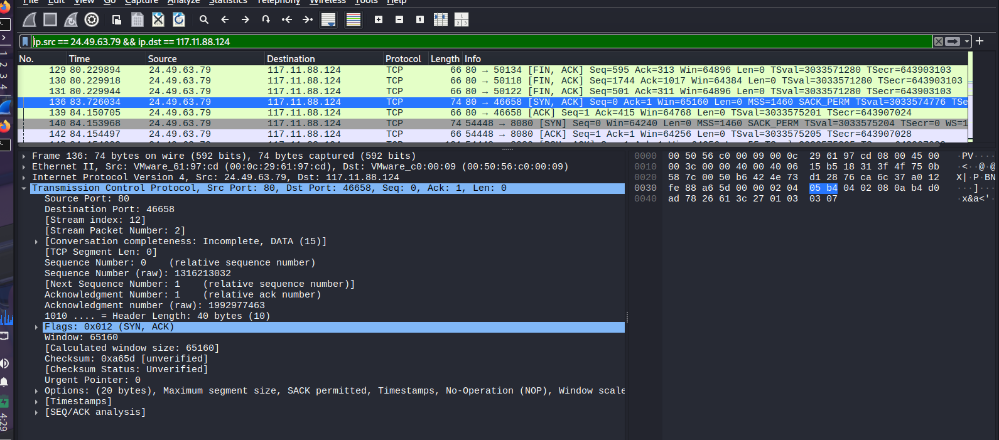

# Finding 5 - Outbound Communication Port

### Objective

Determine the outbound communication port used by the malicious web shell to establish communication between the compromised server and the attacker-controlled machine.

The purpose of this investigation was to identify whether the uploaded web shell created an external connection that could allow the attacker to maintain control over the compromised system.

***

## Investigation Steps

1. Identified the attacker IP address from previous packet analysis:

```
117.11.88.124
```

2. Identified the compromised server IP address:

```
24.49.63.79
```

3. Filtered network traffic to display only outbound communication from the compromised server to the attacker.
4. Analyzed TCP conversations to identify unusual outbound ports.
5. Compared connection duration, packet count, and transferred data volume to determine the most likely command-and-control communication channel.

***

## Wireshark Filter Used

### Filter:

```
ip.src == 24.49.63.79 && ip.dst == 117.11.88.124
```

### Purpose:

This filter was used to isolate traffic originating from the compromised server (**24.49.63.79**) and directed toward the attacker-controlled IP address (**117.11.88.124**).

The filter was selected because the investigation was focused on identifying **outbound communication** initiated by the compromised system after the malicious web shell was uploaded.

It excluded normal incoming attacker requests and allowed analysis of possible:

* Command-and-Control (C2) communication
* Reverse shell activity
* Remote attacker interaction
* Data transfer from the compromised server

***

## TCP Conversation Analysis

After applying the filter, the TCP conversations were analyzed.

The following outbound connections were identified:

<figure><figcaption></figcaption></figure>

***

### Connection 1 — HTTPS Communication

<table data-search="false"><thead><tr><th>Field</th><th>Value</th></tr></thead><tbody><tr><td>Source IP</td><td>24.49.63.79</td></tr><tr><td>Source Port</td><td>54438</td></tr><tr><td>Destination IP</td><td>117.11.88.124</td></tr><tr><td>Destination Port</td><td>443</td></tr><tr><td>Protocol</td><td>TCP</td></tr><tr><td>Packets</td><td>5</td></tr><tr><td>Bytes</td><td>500</td></tr><tr><td>Duration</td><td>0.008 seconds</td></tr><tr><td>Stream ID</td><td>14</td></tr></tbody></table>

Connection:

```
24.49.63.79:54438 → 117.11.88.124:443
```

#### Analysis

Although this connection was directed toward the attacker IP, the communication volume was very small:

* Only 5 packets
* 500 bytes transferred
* Less than one second duration

Due to the limited traffic, this connection was considered unlikely to represent an interactive web shell communication channel.

***

## Connection 2 — Port 8080 Communication

<figure><figcaption></figcaption></figure>

<table data-search="false"><thead><tr><th>Field</th><th>Value</th></tr></thead><tbody><tr><td>Source IP</td><td>24.49.63.79</td></tr><tr><td>Source Port</td><td>54448</td></tr><tr><td>Destination IP</td><td>117.11.88.124</td></tr><tr><td>Destination Port</td><td><strong>8080</strong></td></tr><tr><td>Protocol</td><td>TCP</td></tr><tr><td>Packets</td><td>79</td></tr><tr><td>Bytes</td><td>8,648</td></tr><tr><td>Duration</td><td>107 seconds</td></tr><tr><td>Stream ID</td><td>13</td></tr></tbody></table>

Connection:

```
24.49.63.79:54448 → 117.11.88.124:8080
```

***

## Analysis

The TCP conversation analysis identified port **8080** as the most significant outbound communication channel.

<figure><figcaption></figcaption></figure>

The connection:

```
24.49.63.79 → 117.11.88.124:8080
```

showed:

* Higher packet count (79 packets)
* Larger data transfer volume (8,648 bytes)
* Longer communication duration (107 seconds)

Compared with the connection to port 443, the port 8080 connection demonstrated characteristics more consistent with persistent attacker communication.

Because the connection originated from the compromised server and was directed toward the attacker-controlled machine after web shell deployment, it was identified as the most likely command-and-control communication channel.

***

## Additional Observed Traffic

Several HTTP connections were also observed:

```
117.11.88.124 → 24.49.63.79:80
```

These connections represented normal attacker interaction with the vulnerable web application over HTTP.

Port 80 was not considered the outbound web shell communication port because the traffic direction was:

```
Attacker → Victim Server
```

rather than:

```
Victim Server → Attacker
```

***

## Conclusion

The investigation identified:

```
TCP Port 8080
```

as the most likely outbound communication port used by the malicious web shell to communicate with the attacker-controlled machine.

The confirmed communication path was:

```
24.49.63.79:54448 → 117.11.88.124:8080
```

This outbound connection occurred after the successful upload and access of the malicious PHP file, indicating that the compromised server may have established a command-and-control channel with the attacker.

***
